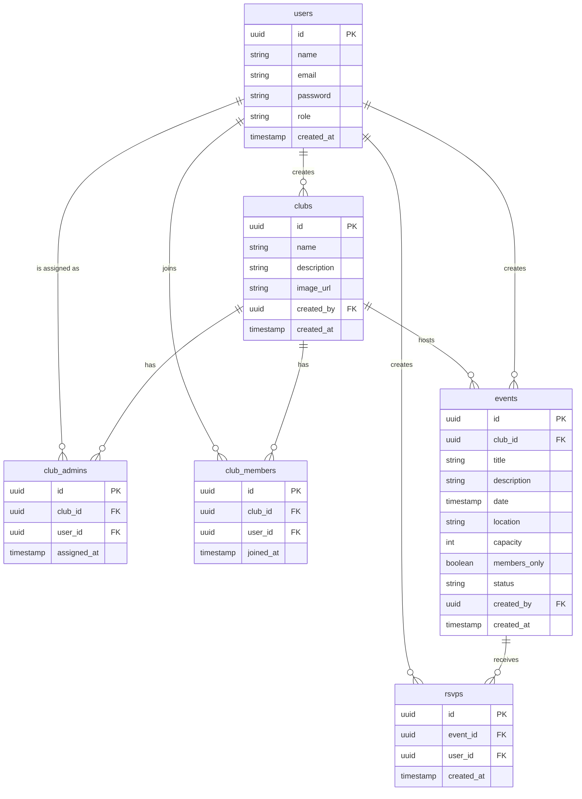

# ER Diagram — University Club Management Portal

## Entities & Relationships

## Relationship Rules

- One user can be admin of many clubs (max 3 admins per club)
- One user can be a member of many clubs
- One club can have many events
- One event can have many rsvps (limited by capacity if set)
- A student can only RSVP to a members_only event if they are in club_members for that club
- The super_admin role is seeded directly — cannot be registered through the app
- Student emails must end in @istanbularel.edu.tr